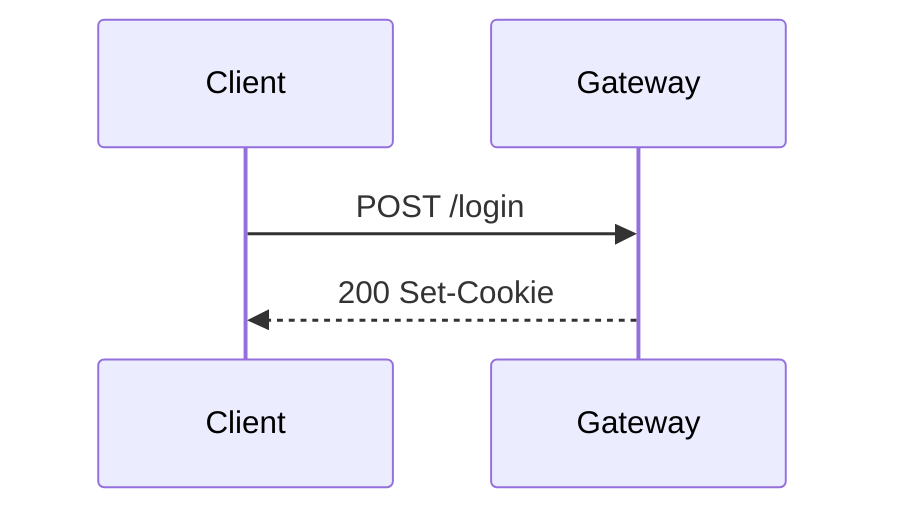

# Visual economy — text vs visualization ladder

类型：Craft handbook（解释/文档/agent 输出里的可视化成本纪律）

| | |
|---|---|
| **What** | 选**够用的最便宜可视化**，而不是默认前端三件套或 34 套 HTML deck。 |
| **Why** | Agent 与小团队的绑定约束是注意力与维护成本。重可视化常增加「进度感」却不增加决策清晰度。 |
| **Who** | 写 docs/IA/AUDIT、PR 说明、内部 deck、产品说明的人与 agent。 |
| **How to use** | ① 写 claim + 读者问题 → ② §1 梯子从下往上爬，读懂即停 → ③ 只有交付物**本身是审美 deck** 才上 zarazhangrui。 |
| **Not this** | 不是禁止漂亮幻灯片；不是 ASCII 宗教；不是 Mermaid 能画一切。 |

**一句话：** 图答 *连什么 / 谁跟谁 / 什么顺序*；文答 *为什么 / 边界 / 失败 / 何时不做*。默认 **文字把机制说清楚**；结构用 **ASCII 或 Mermaid**；品牌/对外再 **HTML deck**；React/Three 只给真正的产品表面。

**Agent 友好 = text-in / structure-out：** ASCII ≥ Mermaid ≥ C4-as-code ≫ draw.io 二进制。要能 `grep`、diff、就地改源。

---

## 1. 可视化梯子（从便宜到贵）

| 阶 | 形式 | 成本 | 何时够用 | 何时升级 |
|---|---|---|---|---|
| **0** | 纯散文 + 列表/表 | 最低 | 定义、闸、清单、决策理由、对比表 | ≥3 节点关系 / 时序交叉 / 分支 |
| **1** | **ASCII** 框线 / 箭头 | 极低；diff；终端/Slack 可用 | 流水线、目录树、请求路径、权限边界、incident 草图 | 分支密、多 actor 时序、要 GH 原生美化 |
| **2** | **Mermaid** fence | 低；依赖渲染表面 | PR/README/docs：flowchart / sequence / state / er | 表面不渲染；>15–20 节点；要品牌 SVG/讲演 |
| **3** | 单文件 **SVG** / 极简 HTML | 中 | 跨站插图、PDF/Slack、像素标注；**保留 .mmd 源** | 多页叙事、固定舞台、品牌模板 |
| **4** | **轻 HTML deck**（一模板、少动效） | 中高 | 内部分享、课程提纲 | 对外融资/品牌 manifesto |
| **5** | **beautiful-html-templates / frontend-slides** | 高 | 交付物**就是**漂亮幻灯片 | — |
| **6** | React/Canvas/Three | 最高 | 产品本身 / 可玩原型 | **禁止**用于一次性架构说明 |

**升降硬规则：**

1. 先写 **一句 claim + 读者问题**（谁调谁？失败谁背？边界在哪？）。  
2. 选能直接回答的 **最低档**。  
3. 同档优先 **可 diff 文本源**；截图是最后手段。  
4. 升档必须点名缺口，禁止「显得专业」。

**默认停靠：** 内部 agent 文档与 IA → **0–2**。对外讲故事 → **4–5**。产品内图表 → 产品 DESIGN，不是 deck 库。

**表面门控：** GitHub PR/README、多数 docs 站 → Mermaid OK。Slack / 纯终端 / 部分 npm README → **ASCII 或导出 SVG**，别甩 raw fence 当唯一交付。

---

## 2. 文字 : 可视化 比例（作业闸，非宗教数字）

| 产物 | 文 | 图 | 说明 |
|---|---|---|---|
| 决策备忘 / 机制 / IA / craft | 70–85% | 15–30% | 1 张关系图 + 强 prose；图不重复 bullet |
| PR / 变更说明 | 50–70% | 30–50% | 1–3 张 intent 图；其余列表 |
| README 架构鸟瞰 | 40–60% | 40–60% | 1 张分层图 + 短边界说明 |
| Incident 时序 | 40–50% | 50–60% | sequence/ASCII 是主角；文补因果 |
| 对外 keynote / brand deck | 15–35% | 65–85% | speaker-led 少字；reading deck 可更密 |
| 纯表格 / 成本对比 | 90%+ | 0–10% | **表就是可视化**；勿画装饰饼图 |

**够用定义：** 读者 **3 秒** 能指出主路径起点/终点；细节在图下 prose。

**冗余：** 口播 + 满屏 bullet + 大图 = 认知过载。Docs 无旁白 → 图侧短标签 + 图下机制。Deck 有口播 → 少 bullet，勿念稿上屏。

---

## 3. 低成本配方

### 3.1 ASCII（优先 git diff / 终端）

```text
[User] → API → (ACL) → Search index
                ↓
            zero_result event
```

纪律：

- 一流抽象一张图；盒内细节另开第二张  
- 流向 TB 或 LR，全文一致；约 **3–7 盒**  
- 注释放侧注，不塞盒内；trust boundary 可用双线  
- 等宽字体；超宽宜折行（常 <72–80 列）  
- 复杂盒绘可选 Monodraw 等，**提交纯文本导出**，勿把专有二进制当 SoT  

### 3.2 Mermaid（结构 / 时序）

| 读者问题 | 类型 |
|---|---|
| 步骤/分支？ | `flowchart` TD（分支）/ LR（短链） |
| 谁与谁、按时间？ | `sequenceDiagram` |
| 状态机？ | `stateDiagram-v2` |
| 表关系？ | `erDiagram` |

````markdown

````

纪律：

- 节点名词、边动词；边标签 ≤5 词；有意义 ID（`AuthSvc` 非 `A`）  
- 主路径清晰；次要边砍进 prose  
- **≤15–20 有效节点**；上帝图拆分层  
- 颜色 ≤3–4 语义；GH 可靠用 `classDef`/`style`，少依赖花活主题  
- LLM 坑：标签特殊字符可导致**静默不渲染** → 推后目视或 mmdc  
- 渲染失败时 **ASCII 或列表双轨**仍可读  
- 复杂状态机：先 **状态×事件表** 再图  

### 3.3 轻 SVG / 单文件 HTML

- `mmdc` / mermaid.live → 提交 **svg + .mmd 源**  
- 单文件 HTML：图 + 短说明；**不要**上 slide runtime  
- 升档信号：必须在 GitHub 外仍像图；或要红圈/尺寸标注  

### 3.4 全套 HTML deck（阶 5）

仅当用户明确要 **演讲/课程/品牌幻灯** 时：

1. 读 [`README.md`](./README.md)  
2. `upstream/beautiful-html-templates`：tone-first（AGENTS.md + index.json）  
3. `upstream/frontend-slides`：固定 1920×1080、动效、PPTX 转换  
4. 纸纹：本 pack `paper-shaders` + overlays（勿重复发明）  

Deck 纪律：每页一个 **main character**（3 秒记住什么）；砍 safety slides；动画服务焦点不飞子弹；保模板 fonts/palette/grid，只换内容。

**禁止：** 用全套 deck 写内部 architecture RFC「因为模板好看」。

### 3.5 React / Three

仅产品/玩具本身。架构说明用静态 SVG 序列或短录屏，不要上完整 app 壳。

---

## 4. 反模式

| 反模式 | 改做 |
|---|---|
| 内部 memo 默认 Vite+React+组件库 | md + Mermaid/ASCII |
| `architecture.drawio` 当 SoT | Mermaid/C4 文本；draw.io 仅导出给 stakeholder |
| 40 节点上帝图 | 分层多图 + 链接 |
| Mermaid 画线性 checklist | ordered list / table |
| 幻灯 bullet = 演讲稿 | 标题+一图；notes 私有 |
| 装饰大图抢 main character | 概念视觉最大 |
| Three 背景讲权限模型 | 静底或 paper veil（且非架构必需） |
| 截图当唯一源 | 文本源 + 导出物 |
| 同一 PR 塞 5+ 张装饰图 | 1–3 张 intent 图 |
| npm README 只贴 mermaid fence | 并行 SVG |
| 过早彩虹 `classDef` | 先无色拓扑，必要时 2 色（新/旧） |

---

## 5. 与 zarazhangrui 包的关系

| 包 | 角色 |
|---|---|
| [frontend-slides](https://github.com/zarazhangrui/frontend-slides) | 舞台/动效/PPTX→HTML 技能 |
| [beautiful-html-templates](https://github.com/zarazhangrui/beautiful-html-templates) | 34 mood 模板 + index 选型 |

Vendored：`templates/decks/upstream/`（无 screenshots）。  
刷新：`bash scripts/sync-upstream-decks.sh`。  
Liz 纠偏：`templates/decks/overlays/`。

**选型冲突时：** 本文 **压过**「因为有模板所以做 deck」。

---

## 6. Agent 执行清单

- [ ] claim + 读者问题已写  
- [ ] 先散文/表；需要结构再 ASCII 或 Mermaid  
- [ ] 渲染表面已考虑（GH vs Slack vs 终端）  
- [ ] 图 ≤15–20 节点或已拆分；无上帝图  
- [ ] 源码可 diff；非截图唯一源  
- [ ] 升到阶 5 前：确认 occasion + mood，走 beautiful-html 流程  
- [ ] 不把 deck 模板当 B2B 后台 UI 组件库  
- [ ] 不把 React/Three 用于一次性说明文  

---

## 7. 开火路径

**IA / craft：** 表 + 可选 1 张 flowchart/ASCII，禁止开 template 库。  
**PR：** 1 sequence 或 1 flowchart + 列表边界。  
**对外 10 页 pitch：** `decks/README` → 三候选 title 预览 → 一套模板。  
**解释搜索系统：** ASCII 请求链 + `search-craft.md`，不必幻灯片。

---

## 8. 延伸阅读（机制向）

- GitHub Docs · Mermaid 在 Issues/PR/md 中的支持  
- Mermaid 官方 diagram 类型文档  
- 本地研究备忘：`agent-context/research/2026-08-17-visual-economy-memo.md`（若存在）  
- 本目录 upstream：`frontend-slides` / `beautiful-html-templates` 的 SKILL + AGENTS
