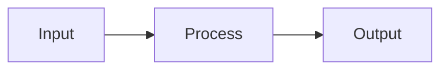

# Visual economy — text vs visualization ladder

类型：Craft handbook（解释/文档/agent 输出里的可视化成本纪律）

| | |
|---|---|
| **What** | 选**够用的最便宜可视化**，而不是默认前端三件套或 34 套 HTML deck。 |
| **Why** | Agent 与小团队的绑定约束是注意力与维护成本。重可视化常增加「进度感」却不增加决策清晰度。 |
| **Who** | 写 docs/IA/AUDIT、PR 说明、内部 deck、产品说明的人与 agent。 |
| **How to use** | ① §1 梯子从下往上爬 → ② 命中停 → ③ 只有交付物**本身是审美 deck** 才上 zarazhangrui 全套。 |
| **Not this** | 不是禁止漂亮幻灯片；不是 ASCII 宗教；不是 Mermaid 能画一切。 |

**一句话：** 默认 **文字把机制说清楚**；需要结构时用 **ASCII 或 Mermaid**；需要品牌/对外呈现再 **HTML deck**；React/Three 只给真正的产品表面。

---

## 1. 可视化梯子（从便宜到贵）

| 阶 | 形式 | 成本 | 何时够用 | 何时升级 |
|---|---|---|---|---|
| **0** | 纯散文 + 列表/表 | 最低 | 定义、闸、清单、决策理由 | 关系/时序说不清 |
| **1** | **ASCII** 框线 / 箭头 | 极低；diff 友好 | 流水线、目录树、请求路径、权限边界 | 分支/并行太多、要给非技术观众 |
| **2** | **Mermaid**（flowchart / sequence / state） | 低；多数 Markdown 可渲染 | 多角色时序、状态机、部署拓扑 | 要精确排版/品牌色/全屏演讲 |
| **3** | 单文件 **SVG** 或极简 HTML 图 | 中 | 一页图解、图标系统示意 | 多页叙事、动效、固定舞台 |
| **4** | **轻 HTML deck**（一模板、少动效） | 中高 | 内部分享、课程提纲 | 对外融资/品牌 manifesto |
| **5** | **beautiful-html-templates / frontend-slides** | 高（选模板+适配） | 交付物**就是**漂亮幻灯片 | — |
| **6** | React/Canvas/Three 产品 UI | 最高 | 产品本身需要交互可视化 | 绝不用于一次性说明文 |

**默认停靠：** 内部 agent 文档与 IA → **0–2**。  
**对外讲故事** → 评估 4–5。  
**产品内图表** → 走产品 DESIGN，不是 deck 库。

---

## 2. 文字 : 可视化 比例（经验闸）

| 产物 | 建议 |
|---|---|
| IA / craft / AUDIT | **≥80% 文字与表**；图只解释关系 |
| PR / 设计决策 | 1 张结构图 + 正文；禁止纯截图墙 |
| 内部分享 15 min | 图可到 40–50%，但每张图一句「所以呢」 |
| 融资/品牌 deck | 视觉主导，但每页仍有可引用主张句 |
| 代码注释 | ASCII/Mermaid 优先于外链图 |

反模式：

- 为「显专业」把 5 行决策做成 12 页 HTML  
- 用 Three.js 背景讲权限模型  
- Mermaid 嵌套过深（>2 层子图）导致不可读——拆成两张或改表  
- ASCII 画地图却无图例/流向  

---

## 3. 低成本配方

### 3.1 ASCII（优先给 git diff）

```text
[User] → API → (ACL) → Search index
                ↓
            zero_result event
```

用途：请求链、对象门、过滤器位置。保持等宽；避免依赖 Unicode 复杂盒绘除非读者环境确定。

### 3.2 Mermaid（结构/时序）

````markdown

````

纪律：

- 节点标签短；细节放正文  
- sequenceDiagram 表「谁在何时」；flowchart 表「对象怎么流」  
- 渲染失败时 ASCII 必须仍可读（双轨：图 + 等价列表）  
- 复杂状态机：先表（状态×事件）再图  

### 3.3 轻 HTML / SVG

单页、无构建、系统字体或已有 web font；禁止为说明文拉打包器。

### 3.4 全套 HTML deck（阶 5）

仅当用户明确要 **演讲/课程/品牌幻灯** 时：

1. 读 `templates/decks/README.md`  
2. `beautiful-html-templates`：tone-first 选模板（AGENTS.md）  
3. `frontend-slides`：固定舞台、动效、PPTX 转换  
4. 纸纹/氛围：本 pack `paper-shaders` + Liz overlay（勿重复发明）

---

## 4. 与 zarazhangrui 包的关系

| 包 | 角色 |
|---|---|
| [frontend-slides](https://github.com/zarazhangrui/frontend-slides) | Agent 做网页幻灯的技能与舞台/动效语法 |
| [beautiful-html-templates](https://github.com/zarazhangrui/beautiful-html-templates) | 34 套 mood 模板 + `index.json` 选型 |

Vendored 路径：`templates/decks/upstream/`（无 screenshots）。  
持续更新：`bash scripts/sync-upstream-decks.sh`。  
Liz 纠偏：`templates/decks/overlays/`（如 paper-shaders patch）。

**选型冲突时：** visual-economy **压过**「因为有模板所以做 deck」。

---

## 5. Agent 执行清单

- [ ] 先用文字写清机制与决策  
- [ ] 若需要结构：ASCII 或 Mermaid，二选一先试  
- [ ] 读者是 git/PR？优先 ASCII/Mermaid 源码  
- [ ] 读者是舞台演讲？再升 HTML deck  
- [ ] 升到阶 5 前：确认 occasion + mood，走 beautiful-html 流程  
- [ ] 不把 deck 模板当 B2B 后台 UI 组件库  

---

## 6. 开火路径

**今天下午写 IA：** 表 + 可选一张 mermaid flowchart，禁止开 template 库。  
**今天下午对外 10 页 pitch：** `decks/README` → 三候选 title 预览 → 一套模板填完。  
**解释搜索系统：** ASCII 请求链 + 本 pack `search-craft.md` 表，不必幻灯片。
